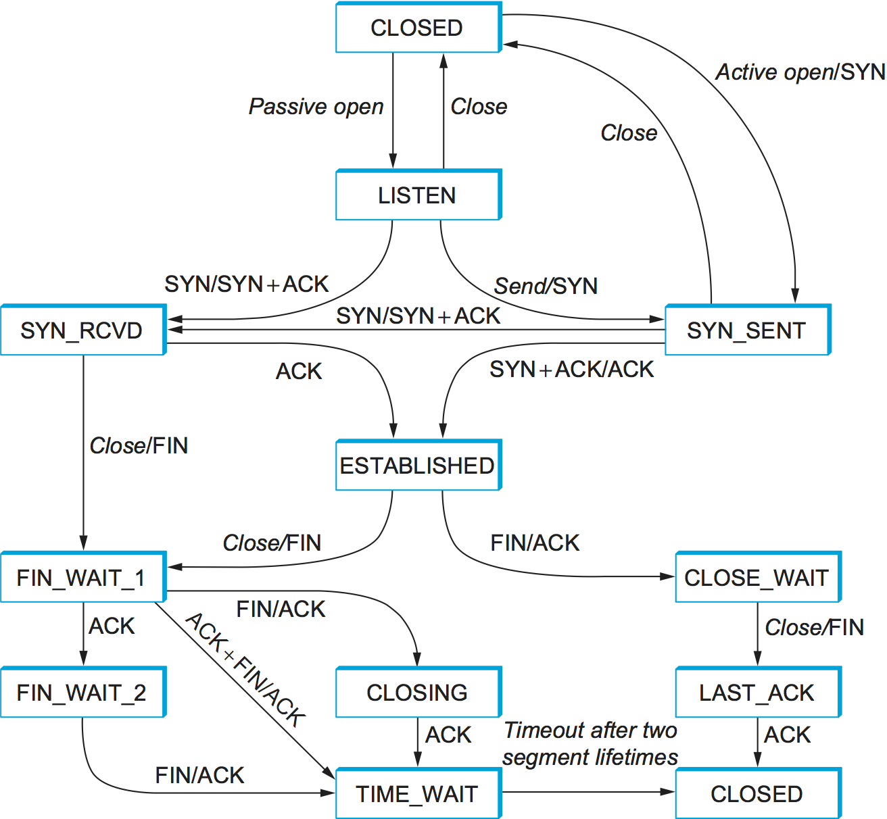

# simple_tcp
Implements a simplified for TCP with custom header packet headers, and flow/congestion control.

- Project 3 for CSDS 325: Networks
- @bluey22
- Python: 3.10.12 Linux: 22.0.4 Ubuntu

Please see [TCP Notes](tcp_notes.md) for further information about TCP.

# Complete TCP State Machine

# HOW TO RUN
1) Open up two terminals
2) run server.py in one, and client.py in the other. You can observe the outputs or use wireshark
