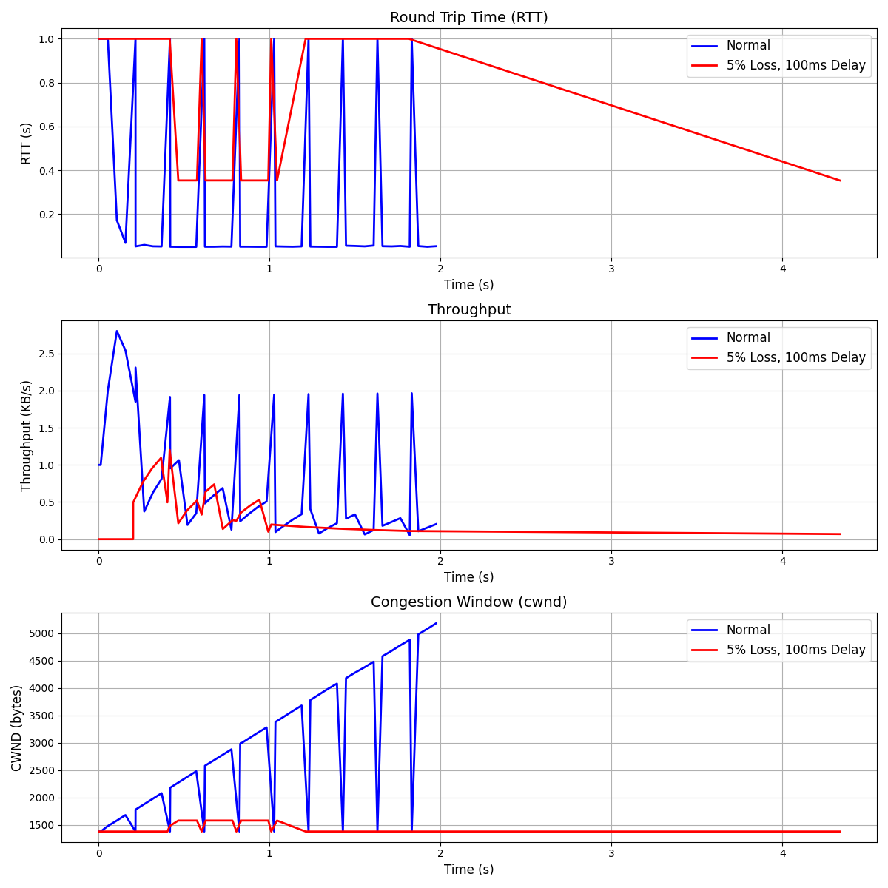

# simple_tcp
Implements simple TCP over UDP with custom header packet headers, sliding window algorithm, flow controw, and congestion control (Tahoe).

- Python: 3.10.12 Linux: 22.0.4 Ubuntu

## Project Setup
Only needed for section `Visualize RTT, Throughput, and Congestion Control` to graph test results.
- You can still run `HOW TO RUN` below without a virtual environment, and skip this section.

Set up a local virtual environment and download requirements:
```bash
python3 -m venv venv
source venv/bin/activate

pip install r requirements.txt
```

# HOW TO RUN
Note: Might need to run more than once for coherent outputs - my apologies. Should work well under good to moderate network settings.
1) Open up two terminals
2) run server.py in one, and client.py in the other. You can observe the console outputs directly or use wireshark (see tcp_over_udp.lua)
3) At the end of the console, you can see the alpha value and the final estimated RTT (you can play around with the _ALPHA parameter at the top of transport.py)

For 2) Try running it in perfect conditions. Then, you can alter network conditions with the following commands:
```bash
sudo tc qdisc add dev lo root netem delay 100ms loss 10%
sudo tc qdisc del dev lo root netem
```
    - This will allow you to see retransmits and more interesting happenings
    - Will also change the RTT estimations

# Visualize RTT, Throughput, and Congestion Control
Please tcp_performance_big_ssthresh.png and tcp_performance_small_ssthresh.png (linear growth) below for example outputs:

1) Complete the setup in Project Setup
2) Run simple_tcp_test.py and follow the console instructions
    - IMPORTANT: You'll have to hit enter 3 times to advance (it will prompt you, but may disappear). 1 For start, 2 for loss conditions, 3 for results. If the terminal hangs, try enter before retrying or ctrl + c. You will get prompted, this is just a reminder if it disappears from the console, so please be patient (sorry)
    - You'll be prompted to open up another terminal and try 5% loss. We're blasting data here, so I wouldn't really go above this. Can see breaks after this point.
```bash
    # simple_tcp_test.py summary

    # Run normally first

    # Run this command in a separate terminal (per console instructions)
    sudo tc qdisc add dev lo root netem delay 100ms loss 5%

    # Press enter for final results and graphs, but don't forget this to get normal network conditions back
    sudo tc qdisc del dev lo root netem
```

Please see [TCP Notes](tcp_notes.md) for further information about TCP that I used to build this.

# RTT, Throughput, and CWND monitoring (Test script connecting jumps the peaks, have to fix)



# Complete TCP State Machine


