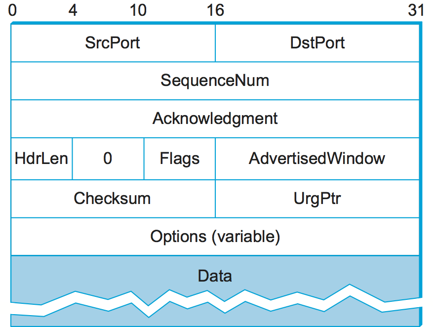

# Notes on TCP 
- Introduction (todo)
- Segment Format
- Connection Establishment
- Connection Termination
- TCP State Transition Diagram
- Sliding Window (todo)
- Flow Control (todo)
- Adaptive Retransmission (todo)

# Segment Format
TCP is a byte-oriented protocol where a reasonable sized # of bytes are packaged in a packet/segment to be sent over the internet.
The receiver empties the content of the packet into a receive buffer, then reads from it at leisure.

- SrcPort (16 bits) | DstPort (16 bits)
- SequenceNum (32 bits)
- Acknowledgement (32 bits)
- HdrLen - Data Offset by 32 bit words (4 bits)   |   0/Reserved (3 bits)   |   Flags (9 bits)  |   Advertised Window #bytes (16 bits)
- CheckSum (16 bits)    |   UrgPtr (16 bits)
- Options (32 bits)
- Payload Data

The TCP's demux key is the 4-tuple: `(SrcPort, SrcIPAddr, DstPort, DstIPAddr)`

Each byte sent has a sequence number. 
- `SequenceNum` contains the sequence number for the first byte of data carried in the segment
- `Acknowledgement` and `AdvertisedWindow` contains next sequence number start and # of willing bytes able to receive for incoming peer

The Flags are `SYN`, `FIN`, `RESET`, `PUSH`, `URG`, and `ACK`

# Connection Establishment (3 step)
A client does an active open to a server who had previously done a passive open. Once `ESTABLISHED`, only then data can flow.
- This is asymmetric, so one side can `close()`, but the other side may keep the conneciton open to send data.
- In practice, TCP allows a connection setup to be symmetric with TCP State handling and transitions

3 Way Handshake:
- `SYN`, `SequenceNum = x`                                          => `SYN` From A to B
- `ACK`, `Ack = x + 1`, `SYN`, `SequenceNum = y`, `SequenceNum=x`   => `SYN + ACK` From B to A
- `ACK`, `Ack = y + 1`, (Could add payload to begin transmitting)   => `ACK` From A to B

## Handshake States and Descriptions
CLOSED
- Cause: Initial state of a socket before it’s bind()ed, connect()ed, or listen()ing. Also the final state after TIME_WAIT or LAST_ACK is done.
- State_Desc: Socket is inactive. No connection exists yet. Can be reused to start a new connection.

LISTEN (Passive Open)
- Cause: Server calls listen() on a bound socket.
- State_Desc: Socket is ready to accept incoming connection requests. Waiting for a SYN from a client.

SYN_SENT
- Cause: Client calls connect() on a socket, which sends a SYN. Transition from CLOSED → SYN_SENT.
- State_Desc: Actively trying to connect to a remote peer. Waiting for a SYN-ACK in response to our SYN.

SYN_RECEIVED
- Cause: Server in LISTEN receives a SYN, responds with SYN-ACK, and transitions to SYN_RECEIVED.
- State_Desc: Halfway through the 3-way handshake. Waiting for final ACK from client to complete connection. (Also: if you're a client and receive a simultaneous SYN, you can also briefly enter SYN_RECEIVED.)

ESTABLISHED
- Cause:
    - Client: From SYN_SENT, received SYN-ACK, sent ACK
    - Server: From SYN_RECEIVED, received final ACK
- State_Desc: Fully open connection. Can send and receive data.

FIN_WAIT_1
- Cause:
    - Most commonly: app calls close() on an active connection (ESTABLISHED) → send FIN, enter FIN_WAIT_1
    - Less commonly: from SYN_RECEIVED, if you want to close during handshake, TCP can send FIN along with SYN-ACK and enter FIN_WAIT_1
- State_Desc: You’ve sent a FIN, waiting for an ACK (or possibly the peer’s FIN if simultaneous close).

# Connection Termination (4 step)

Initiator POV (starts in ESTABLISHED):
- Time = 1 : Send FIN to Receiver and transition to FIN_WAIT_1
- Time = 2 : Receive ACK of FIN from receiver and transition to FIN_WAIT_2
- Time = 3 : Receive FIN from receiver and transition to TIME_WAIT, Send ACK of FIN to receiver
- Time = 4 : Transition to CLOSED

Receiver POV (starts in ESTABLISHED):
- Time = 1.5 : Receive FIN from initiator, send ACK and transition to CLOSE_WAIT (passive close)
- Time shortly after 1.5 : Send ACK of FIN from initiator, and send own FIN. Transition to LAST_ACK
- Time 3.5 : Receive ACK of FIN from initiator, transition to CLOSED

## Initiator Termination

FIN_WAIT_1: 
- Cause: Send FIN and transition from ESTABLISHED. 
- State_Desc: Wait for ACK after sending FIN

FIN_WAIT_2: 
- Cause: Received ACK for FIN that was sent (anything other ACK is handled elsewhere). Transitioned from FIN_WAIT_1
- State_Desc: My FIN was ACK'ed. Now I'm waiting for the other side to send their FIN

TIME_WAIT:
- Cause: Received FIN and will now send an ACK. Transitioned from FIN_WAIT_2
- State_Desc: Ensure any delayed or duplicated packets won't interefere with a new connection (or help with retransmissions). Ties up a (src IP, src port, dst IP, dst port) tuple

CLOSED:
- Cause: Spent 2 * Max_Segment_Lifetime in TIME_WAIT, transition to CLOSED
- State_Desc: Wait completed, socket connection can now be be-used for TCP

## Receiver Terminatnion

CLOSE_WAIT: 
- Cause: Was in the ESTABLISHED state, but received a FIN packet and sent an ACK.
- State_Desc: Waiting for app to call `close()`

LAST_ACK: 
- Cause: App called `close()` (or maybe we timed out and should clean up this socket). Send a FIN. Transitioned from CLOSE_WAIT
- State_Desc: Sent FIN, waiting for ACK so we can close.

CLOSED:
- Cause: Received ACK for my FIN (Received last ACK). Transitioned from LAST_ACK
- State_Desc: Wait completed, socket connection can now be be-used for  (Whoever sends last ACK needs to TIME_WAIT)

# TCP State Diagram

### Sources (for information and images)
- https://book.systemsapproach.org/e2e/tcp.html#state-transition-diagram
- https://www.geeksforgeeks.org/tcp-connection-termination/
